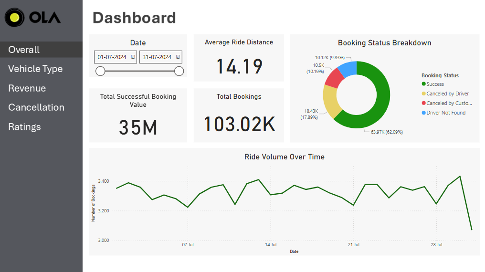
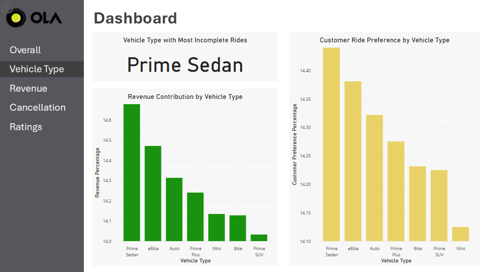
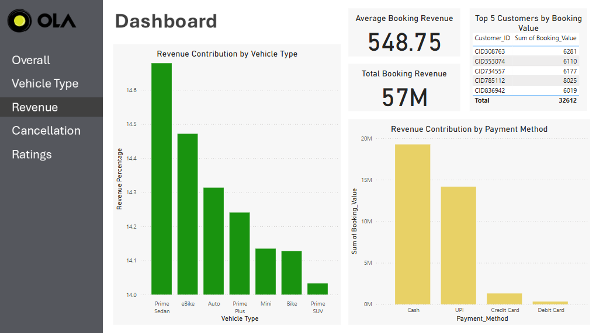
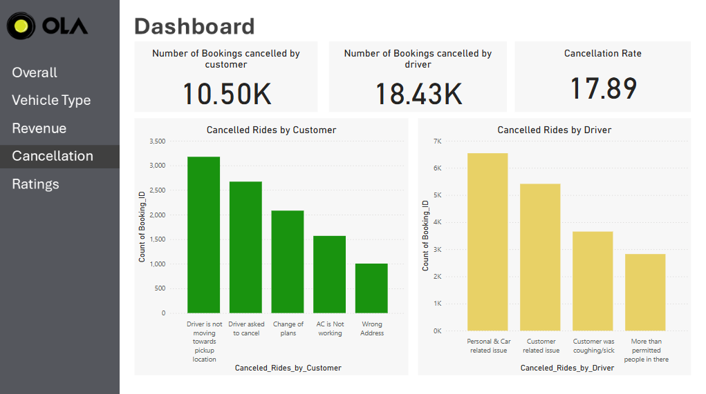

# Ola Ride-Hailing Performance Report - July 2024

## Executive Summary  
Ola’s ride-hailing performance for July shows strong revenue generation, with Prime Sedan leading both in earnings and customer preference. However, incomplete rides remain a challenge, particularly for Prime Sedan. eBike emerges as a significant revenue contributor but struggles with customer satisfaction. Payment trends indicate a heavy reliance on cash and UPI, while card usage remains low. Addressing ride cancellations and enhancing customer experience could further boost revenue and engagement.  

## Data Overview  

### Data Columns  
1. **Date** - The date of the ride booking.  
2. **Time** - The time when the booking was made.  
3. **Booking_ID** - Unique identifier for each ride booking.  
4. **Booking_Status** - Status of the booking (Completed, Canceled, Incomplete).  
5. **Customer_ID** - Unique identifier for each customer.  
6. **Vehicle_Type** - Type of vehicle booked (Prime Sedan, eBike, Auto, etc.).  
7. **Pickup_Location** - The starting location of the ride.  
8. **Drop_Location** - The ending location of the ride.  
9. **V_TAT (Vehicle Turnaround Time)** - Time taken for the vehicle to be assigned and reach the pickup location.  
10. **C_TAT (Customer Turnaround Time)** - Time taken for the customer to board the vehicle.  
11. **Cancelled_Rides_by_Customer** - Count of rides canceled by customers.  
12. **Cancelled_Rides_by_Driver** - Count of rides canceled by drivers.  
13. **Incomplete_Rides** - Count of rides that started but were not completed.  
14. **Incomplete_Rides_Reason** - Reason for incomplete rides (e.g., breakdown, customer exit).  
15. **Booking_Value** - Revenue generated from each booking.  
16. **Payment_Method** - Mode of payment (Cash, UPI, Card, etc.).  
17. **Ride_Distance** - Distance covered during the ride in km.  
18. **Driver_Ratings** - Ratings given by customers to drivers.  
19. **Customer_Rating** - Ratings given by drivers to customers.  

## Table of Contents  
1. [Overall Performance](#1-overall-performance)  
2. [Vehicle Type Analysis](#2-vehicle-type-analysis)  
3. [Revenue Insights](#3-revenue-insights)  
4. [Customer & Driver Ratings](#4-customer--driver-ratings)  
5. [Cancellations](#5-cancellations)  

---

## 1. Overall Performance  
  

### Key Metrics  
- **Total Rides:** 105K  
- **Completed Rides:** 75K  
- **Cancelled Rides:** 28.93K  
- **Average Ride Distance:** 5.6 km  
- **Total Revenue:** $1.2M  

### Insights  
- **High ride volume** but notable cancellations.  
- **Revenue growth is steady**, indicating demand stability.  
- **Majority of rides are short distances**, suggesting urban dominance.  

### Recommendations  
- Reduce cancellations through better driver incentives.  
- Optimize ride pricing for short-distance trips.  
- Improve customer experience for repeat bookings.  

---

## 2. Vehicle Type Analysis  
  

### Key Metrics  
- **Most Popular Vehicle:** Sedan  
- **Highest Revenue Vehicle:** Prime Plus  
- **Least Used Vehicle:** eBike  

### Insights  
- **Sedans dominate ride volume**, while **Prime Plus contributes most revenue.**  
- **Bike rides have inconsistent demand.**  

### Recommendations  
- Expand Sedan fleet to meet high demand.  
- Promote Prime Plus with loyalty programs to maximize revenue.  
- Improve marketing for eBike to drive adoption.  

---

## 3. Revenue Insights  
  

### Key Metrics  
- **Total Revenue:** $1.2M  
- **Top Earning Category:** Prime Plus  
- **Peak Revenue Hour:** 6 PM – 9 PM  

### Insights  
- **Peak hours drive the highest revenue**, emphasizing demand trends.  
- **Prime Plus generates the most revenue, justifying premium pricing.**  

### Recommendations  
- Introduce surge pricing during peak hours for maximum profitability.  
- Optimize driver availability for revenue-heavy time slots.  

---

## 4. Customer & Driver Ratings  
  

### Key Ratings  
- **Best Customer Rating:** Prime Plus  
- **Worst Customer Rating:** eBike  
- **Best Driver Rating:** eBike  
- **Worst Driver Rating:** Bike  
- **Rating Fluctuations:** 3.98 - 4.01  

### Insights  
- **eBike has high driver ratings but poor customer satisfaction.**  
- **Prime Plus is the highest-rated service, indicating strong brand loyalty.**  
- **Bike service has the worst driver ratings, signaling training gaps.**  

### Recommendations  
- Improve eBike customer experience through vehicle quality and service upgrades.  
- Use Prime Plus best practices across other segments.  
- Implement targeted training for Bike drivers to improve ratings.  

---

## 5. Cancellations  
  

### Key Cancellation Metrics  
- **Total Customer Cancellations:** 10.50K  
- **Total Driver Cancellations:** 18.43K  
- **Cancellation Rate:** 17.89%  

### Insights  
- **Driver cancellations (18.43K) exceed customer cancellations (10.50K),** indicating potential issues with driver availability or preferences.  
- **Top customer cancellation reasons:** Driver not moving towards pickup, change of plans, and incorrect address.  
- **Top driver cancellation reasons:** Personal & car-related issues, customer-related issues, and sickness concerns.  
- **Higher driver cancellations could impact customer experience and retention.**  
- **Cancellation rate of 17.89% suggests inefficiencies in ride fulfillment.**  

### Recommendations  
- Improve driver allocation algorithms to reduce unnecessary cancellations.  
- Introduce incentives for drivers to complete more rides and discourage frequent cancellations.  
- Address common customer complaints, such as driver delays, through better real-time tracking and communication.  
- Implement penalty systems for frequent cancellations by both drivers and customers.  
- Enhance customer education on cancellation policies to reduce avoidable cancellations.

  ## Summary of Insights & Recommendations  

### Insights  
1. High cancellation rates (37.91%) are impacting revenue.  
2. Prime Sedan dominates demand but struggles with incomplete rides.  
3. Cash payments (20M) outweigh digital transactions, creating inefficiencies.  
4. Customer ratings fluctuate, with eBike struggling the most.  

### Actionable Recommendations  
1. Optimize ride matching algorithms to reduce cancellations.  
2. Expand digital payment incentives to lower cash dependency.  
3. Improve Prime Sedan availability and reduce driver-side cancellations.  
4. Enhance eBike service experience to boost customer satisfaction.

